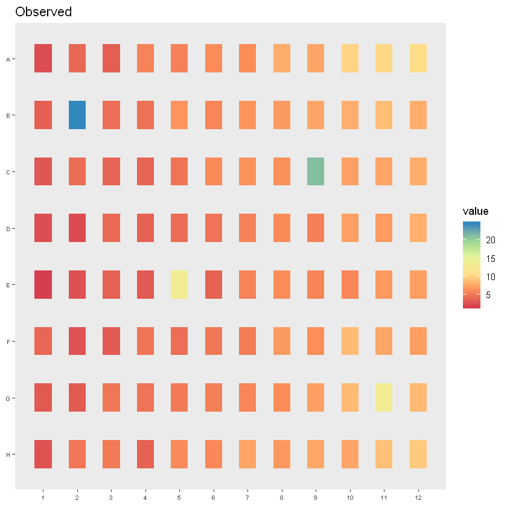
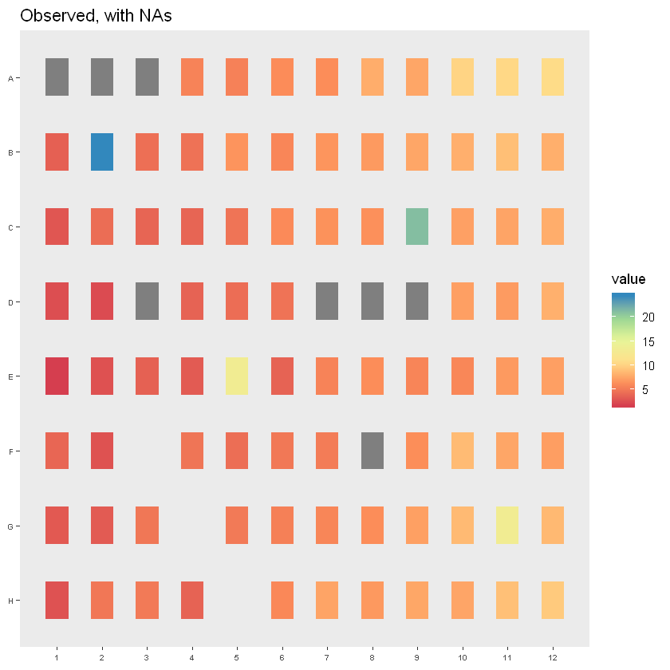
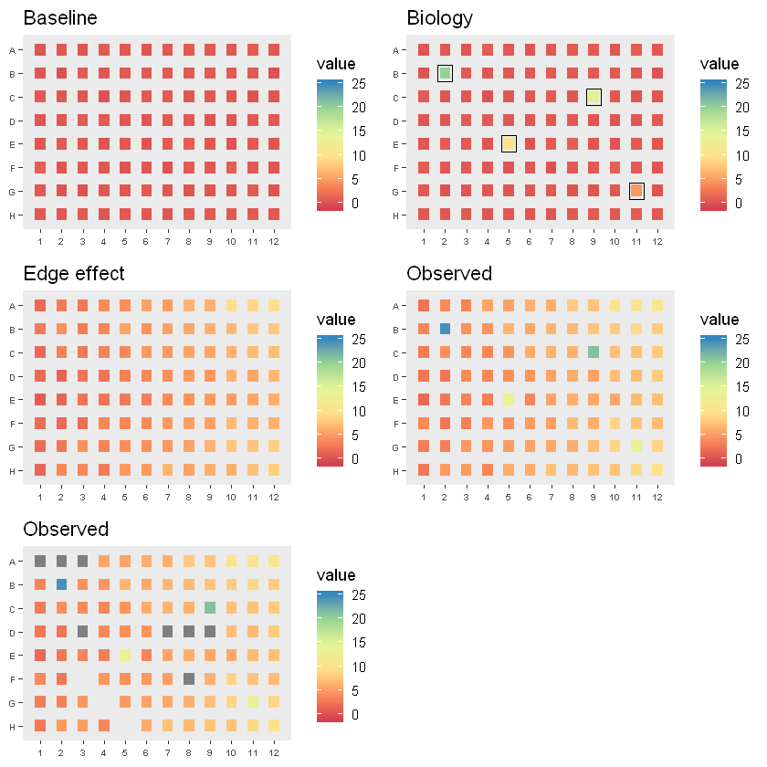
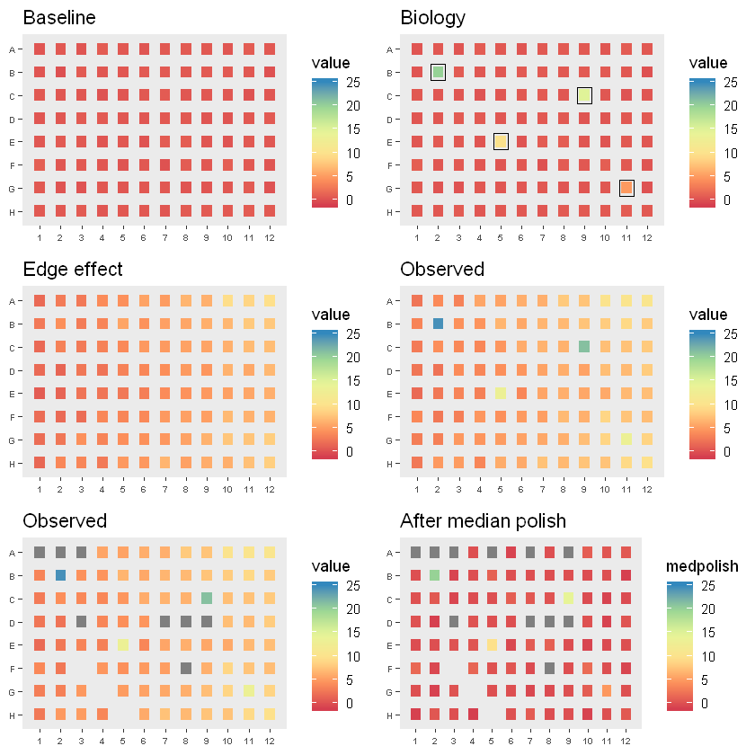
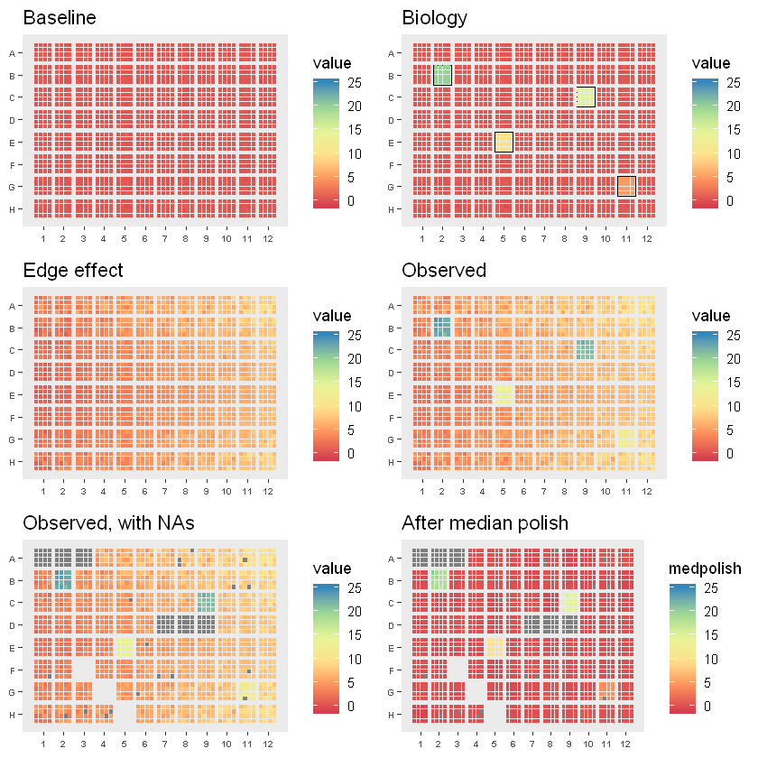

Let us start by loading dependencies.


```R
library(ggplot2)
library(gridExtra)
library(dplyr)

wellCoord_to_xy <- function(coords, nrow, ncol){
    
    # build matrix with well layout
    plate <- matrix(paste0(rep(LETTERS[1:nrow], each=ncol), rep(1:ncol, nrow)), nrow, ncol, byrow = TRUE, dimnames = list(LETTERS[1:nrow], 1:ncol))
    
    # find xy locations
    xy <- sapply(coords, function(x) c(x, which(plate == x, arr.ind = T)))
    xy <- t(xy)[,c(1,3,2)]
    rownames(xy) <- NULL
    
    # return
    result <- if(length(coords) == 1){
        data.frame(coord = xy[1],
                   x     = xy[2],
                   y     = xy[3],
                   stringsAsFactors = FALSE)
    } else{
        data.frame(coord = xy[,1],
                   x     = xy[,2],
                   y     = xy[,3],
                   stringsAsFactors = FALSE)
    }
    
    result
}

wellNum_to_xy <- function(wells, nrow, ncol){
    
    # build matrix with well layout
    nwells <- nrow * ncol
    plate <- matrix(1:nwells, nrow, ncol, byrow = TRUE, dimnames = list(LETTERS[1:nrow], 1:ncol))
    
    # find xy locations
    xy <- sapply(wells, function(x) c(x, which(plate == x, arr.ind = T)))
    xy <- t(xy)[,c(1,3,2)]
    rownames(xy) <- NULL
    
    # return
    result <- if(length(wells) == 1){
        data.frame(well = xy[1],
                   x    = xy[2],
                   y    = xy[3])
    } else{
        data.frame(well = xy[,1],
                   x    = xy[,2],
                   y    = xy[,3])
    }
    
    result
}

# From https://raw.githubusercontent.com/hmbotelho/shinyHTM/master/functions_heatmap.r
# Adds columns with coordinates for plotting
addHeatMapCoordinates <- function(df, colWell, colPos, nWellX, nWellY, nPosX, nPosY, posJitter = 0.2){
    
    
    ############################################
    ########## Initialization ##################
    ############################################
    
    
    # Graphical settings for plotting
    offset_wellborder     <- 1 * posJitter
    offset_wellseparation <- 3 * posJitter
    offset_plateborder    <- 7 * posJitter
    square_size           <- 5 * posJitter
    
    
    # Initialize variables
    nWells <- nWellX * nWellY
    nPos   <- nPosX * nPosY
    
    interwell_distanceX <- nPosX*square_size+(nPosX-1)*posJitter+offset_wellborder*2+offset_wellseparation
    interwell_distanceY <- nPosY*square_size+(nPosY-1)*posJitter+offset_wellborder*2+offset_wellseparation
    
    
    # Matrices describing all plate wells and positions
    mat_wells    <- matrix(1:nWells, nWellY, nWellX, byrow = TRUE)
    mat_allWells <- matrix(unlist(tapply(1:nWells, rep(1:nWellY, each = nWellX), function(x) rep(rep(x, each = nPosX), nPosY))), nWellY * nPosY, nWellX * nPosX, byrow = TRUE)
    mat_allPos   <- matrix(rep(unlist(tapply(1:nPos, rep(1:nPosY, each = nPosX), function(x) rep(x, nWellX))), nWellY), nWellY*nPosY, nWellX*nPosX, byrow = TRUE)
    
    
    
    #################################################
    ########## Compute Coordinates ##################
    #################################################
    
    mat_xMin_pos <- matrix(
        sapply(1:nWellX, function(x) (x-1) * interwell_distanceX + (offset_plateborder + offset_wellborder+0:(nPosX-1)*(posJitter+square_size))),
        nWellX * nPosX,
        nWellX * nPosX,
        byrow = TRUE)
    
    mat_xMax_pos <- mat_xMin_pos + square_size
    
    mat_yMin_pos <- matrix(
        rev(
            sapply(1:nWellY, function(x) (x-1) * interwell_distanceY + (offset_plateborder + offset_wellborder+0:(nPosY-1)*(posJitter+square_size)))
        ),
        nWellY * nPosY,
        nWellX * nPosX,
        byrow = FALSE)
    
    mat_yMax_pos <- mat_yMin_pos + square_size
    
    mat_xMin_well <- matrix(
        offset_plateborder + (0:(nWellX-1))*(offset_wellborder*2+nPosX*square_size+(nPosX-1)*posJitter+offset_wellseparation),
        nWellY,
        nWellX,
        byrow = TRUE)
    
    mat_xMax_well <- mat_xMin_well + 2*offset_wellborder + nPosX*square_size + (nPosX-1)*posJitter
    
    mat_yMin_well <- matrix(
        rev(
            offset_plateborder + (0:(nWellY-1))*(offset_wellborder*2+nPosY*square_size+(nPosY-1)*posJitter+offset_wellseparation)
        ),
        nWellY,
        nWellX,
        byrow = FALSE)
    
    mat_yMax_well <- mat_yMin_well + 2*offset_wellborder + nPosY*square_size + (nPosY-1)*posJitter
    
    mat_xAvg_well <- matrix(
        offset_plateborder + (0:(nWellX-1)) * interwell_distanceX + (0.5*(offset_wellborder*2+square_size*nPosX+posJitter*(nPosX-1))),
        nWellY,
        nWellX,
        byrow = TRUE)
    
    mat_yAvg_well <- matrix(
        rev(
            offset_plateborder + (0:(nWellY-1)) * interwell_distanceY + (0.5*(offset_wellborder*2+square_size*nPosY+posJitter*(nPosY-1)))
        ),
        nWellY,
        nWellX,
        byrow = FALSE)
    
    
    ###########################################################
    ########## Add coordinates to data frame ##################
    ###########################################################
    
    # Initialize data frame columns
    df$HTM_xMin_well <- NA
    df$HTM_xMax_well <- NA
    df$HTM_yMin_well <- NA
    df$HTM_yMax_well <- NA
    
    df$HTM_xMin_pos  <- NA
    df$HTM_xMax_pos  <- NA
    df$HTM_yMin_pos  <- NA
    df$HTM_yMax_pos  <- NA
    
    df$HTM_xAvg_well <- NA
    df$HTM_yAvg_well <- NA
    
    for(i in 1:nrow(df)){
        
        # Well and position numbers
        w <- df[i, colWell]
        p <- df[i, colPos]
        
        # Coordinates
        coord_w <- which(mat_wells == w, arr.ind = TRUE)
        coord_p <- which(mat_allWells == w & mat_allPos == p, arr.ind = TRUE)
        
        # Annotating data frame with coordinates
        if(nrow(coord_w) != 0){
            df[i, "HTM_xMin_well"] <- mat_xMin_well[coord_w]
            df[i, "HTM_xMax_well"] <- mat_xMax_well[coord_w]
            df[i, "HTM_yMin_well"] <- mat_yMin_well[coord_w]
            df[i, "HTM_yMax_well"] <- mat_yMax_well[coord_w]
            df[i, "HTM_xAvg_well"] <- mat_xAvg_well[coord_w]
            df[i, "HTM_yAvg_well"] <- mat_yAvg_well[coord_w]
        }
        if(nrow(coord_p) != 0){
            df[i, "HTM_xMin_pos"]  <- mat_xMin_pos[coord_p]
            df[i, "HTM_xMax_pos"]  <- mat_xMax_pos[coord_p]
            df[i, "HTM_yMin_pos"]  <- mat_yMin_pos[coord_p]
            df[i, "HTM_yMax_pos"]  <- mat_yMax_pos[coord_p]
        }
        
    }
    
    
    # Return annotated data frame
    df
}
# Heatmap plot of measurements in multiwell plates
plotHeatmap <- function(df, xMin_well = "HTM_xMin_well", xMax_well = "HTM_xMax_well", yMin_well = "HTM_yMin_well", yMax_well = "HTM_yMax_well", xMin_pos = "HTM_xMin_pos", xMax_pos = "HTM_xMax_pos", yMin_pos = "HTM_yMin_pos", yMax_pos = "HTM_yMax_pos", xAvg_well = "HTM_xAvg_well", yAvg_well = "HTM_yAvg_well", col_treatment = "Metadata_wellNum", treatmentREGEX = ".*", col_measurement = "measurement", LUTmin, LUTmax, posJitter = 0.2){

    all_xAvg_well <- sort(unique(df[[xAvg_well]]))
    all_yAvg_well <- sort(unique(df[[yAvg_well]]))
    
    nWellX <- length(all_xAvg_well)
    nWellY <- length(all_yAvg_well)
    
    if(missing(LUTmin)) LUTmin <- min(df[[col_measurement]], na.rm = TRUE)
    if(missing(LUTmax)) LUTmax <- max(df[[col_measurement]], na.rm = TRUE)

    ggplot(df) + 
        geom_rect(data=df[grepl(treatmentREGEX, df[[col_treatment]]),], mapping=aes_string(xmin=xMin_well, xmax=xMax_well, ymin=yMin_well, ymax=yMax_well), color="black", fill = NA, alpha = 0.5) +
        geom_rect(data=df, mapping=aes_string(xmin=xMin_pos, xmax=xMax_pos, ymin=yMin_pos, ymax=yMax_pos, fill = col_measurement), color = NA) + 
        theme(panel.grid = element_blank()) +
        scale_x_continuous(breaks = all_xAvg_well, labels = 1:nWellX) +
        scale_y_continuous(breaks = all_yAvg_well, labels = LETTERS[nWellY:1]) + 
        theme(axis.text.x = element_text(size=6, face="bold"), axis.text.y = element_text(size=6, face="bold")) + 
        theme(strip.text.x = element_text(size = 6)) + 
        scale_fill_distiller(palette = "Spectral", direction = 1, limits = c(LUTmin, LUTmax))
}

showHeatMap <- function(df, colWell = "wellNum", colPos = "posNum", colValue = "value", colTreatment = "treatment", showMe = "hit", nWellX = 12, nWellY = 8, nPosX = 1, nPosY = 1, LUTmin, LUTmax){
    df <- addHeatMapCoordinates(df      = df,
                                colWell = colWell,
                                colPos  = colPos,
                                nWellX  = nWellX,
                                nWellY  = nWellY,
                                nPosX   = nPosX,
                                nPosY   = nPosY)
    
    plotHeatmap(df              = df, 
                col_treatment   = colTreatment, 
                treatmentREGEX  = showMe, 
                col_measurement = colValue, 
                LUTmin          = LUTmin,
                LUTmax          = LUTmax,
                posJitter       = 0.2)
    
}

htmMedPolish <- function(df, colWell = "wellNum", colMeasurement = "value", nrow = 8, ncol = 12){
    
    # Supports multi-positions
    # Philosophy:
    #   * Calculate the median of all positions in a well
    #   * Apply median polish on the medians
    #   * For each well, compute the polished/unpolished ratio
    #   * In the original data, multiply all positions by the scaling factor for that well
    
    
    
    # 0. Convenience renaming
    numWells = nrow * ncol
    names(df)[names(df) == colWell] <- "HTM_colWell"
    names(df)[names(df) == colMeasurement] <- "HTM_value"
    
    
    
    
    # 1. Calculate well medians (to support multi-positions)
    wellmed <- df %>% 
        group_by(HTM_colWell) %>% 
        summarise(posNum       = 1,
                  # rowName      = unique(rowName),
                  # colName      = unique(colName),
                  # rowcol       = unique(rowcol),
                  # xWell        = unique(xWell),
                  # yWell        = unique(yWell),
                  # treatment    = unique(treatment)
                  HTM_valueMed = median(HTM_value, na.rm = TRUE)                              )
    wellmed <- as.data.frame(wellmed)
    # showHeatMap(wellmed, colValue = "HTM_valueMed")
    
    
    
    
    # 2. # Add in missing values
    for(w in 1:numWells){
        if(!(w %in% wellmed$HTM_colWell)){
            welldf <- wellmed[0,]
            welldf[1,"HTM_colWell"] <- w
            wellmed <- rbind(wellmed, welldf)
        }
    }
    wellmed <- arrange(wellmed, HTM_colWell)
    #showHeatMap(wellmed, colValue = "valueMed")
    
    
    
    
    # 3. Apply median polish
    mat_wellmed <- matrix(wellmed$HTM_valueMed, nrow, ncol, byrow = TRUE)
    mat_wellmed_medpolish <- medpolish(mat_wellmed, na.rm = TRUE)
    df_wellmed_medpolish <- data.frame(wellNum = 1:numWells,
                                       posNum  = 1,
                                       value   = as.numeric(t(mat_wellmed_medpolish$residuals)),
                                       stringsAsFactors = FALSE)
    # showHeatMap(df_wellmed_medpolish)
    
    
    
    # 4. Calculate ratio
    mat_ratio <- mat_wellmed_medpolish$residuals / mat_wellmed
    
    
    
    
    # 5. Get ratio for each well
    df_ratio <- data.frame(wellNum = 1:numWells,
                           ratio   = as.numeric(t(mat_ratio)),
                           stringsAsFactors = FALSE)
    
    
    
    
    # 6. Multiply observed data by ratio
    df$medpolish <- sapply(1:nrow(df), function(i){
        value        <- df[i, "HTM_value"]
        well         <- df[i, "HTM_colWell"]
        scale_factor <- subset(df_ratio, wellNum == well, select = ratio, drop = TRUE)
        value * scale_factor
    })
    
    
    
    df$medpolish
}

```

    Registered S3 methods overwritten by 'ggplot2':
      method         from 
      [.quosures     rlang
      c.quosures     rlang
      print.quosures rlang
    
    Attaching package: 'dplyr'
    
    The following object is masked from 'package:gridExtra':
    
        combine
    
    The following objects are masked from 'package:stats':
    
        filter, lag
    
    The following objects are masked from 'package:base':
    
        intersect, setdiff, setequal, union
    
    

Now let us simulate some data.

### 96 well plate, 1 subposition per well


```R
set.seed(1)

# This is the baseline
baseline_96_1x1 <- data.frame(wellNum   = 1:96,
                              posNum    = rep(1, 96),
                              rowName   = rep(LETTERS[1:8], each=12),
                              colName   = rep(1:12, 8),
                              rowcol    = paste0(rep(LETTERS[1:8], each=12),
                                                  rep(1:12, 8)),
                              xWell     = rep(1:12, 8),
                              yWell     = rep(1:8, each=12),
                              xPos      = rep(1, 96),
                              yPos      = rep(1, 96),
                              value     = rnorm(96, 0.5, 0.2),
                              treatment = rep("nc", 96),
                              stringsAsFactors = FALSE)

# showHeatMap(baseline_96_1x1) + ggtitle("Baseline")
```

This plate will contain a few "hits"


```R
# These are the hits
hits <- data.frame(wellNum   = c(14, 33, 53, 83),
                   rowName   = c("B", "C", "E", "G"),
                   colName   = c(2, 9, 5, 11),
                   rowcol    = c("B2", "C9", "E5", "G11"),
                   xWell     = c(2, 9, 5, 11),
                   yWell     = c(2, 3, 5, 7),
                   value     = c(20, 15, 10, 5),
                   treatment = rep("hit", 4),
                   stringsAsFactors = FALSE)


# This is the true biological effect
biology_96_1x1 <- baseline_96_1x1
for(i in 1:nrow(biology_96_1x1)){
    ij <- which(hits == biology_96_1x1[i, "rowcol"], arr.ind = TRUE)
    if(nrow(ij) == 1){
        biology_96_1x1[i, "value"]     <- hits[ij[1,1], "value"]
        biology_96_1x1[i, "treatment"] <- hits[ij[1,1], "treatment"]
    }
}

# showHeatMap(biology_96_1x1) + ggtitle("Biology")
```

Let us simulate an edge effect.


```R
mu <- 0.5
sigma <- 0.2
m <-  0.5
b <- 0

# Wave-like (from top to bottom) + Linear gradient (left to right)
edgeeffect_96_1x1 <- baseline_96_1x1 %>%
    mutate(value = rnorm(96, mu, sigma)) %>%
    mutate(value = value + value*abs(5-yWell) + m*xWell+b)

# showHeatMap(edgeeffect_96_1x1) + ggtitle("Edge effect")
```

Overlaying all these contributions, one can expect to observe the following:


```R
# This are the observed values
observed_96_1x1 <- baseline_96_1x1
observed_96_1x1$value <- baseline_96_1x1$value + biology_96_1x1$value + edgeeffect_96_1x1$value

# showHeatMap(observed_96_1x1) + ggtitle("Observed")
```





To make things even more realistic, let us add some NAs and remove some values.


```R
set.seed(1)
# Let us make some values NA and missing values
observed_96_1x1_withNA <- observed_96_1x1
observed_96_1x1_withNA[observed_96_1x1_withNA$wellNum %in% c(1,2,3,43,44,45),"value"] <- NA
observed_96_1x1_withNA[sample(1:nrow(observed_96_1x1_withNA), 2),"value"] <- NA
observed_96_1x1_withNA <- subset(observed_96_1x1_withNA, !(rowcol %in% c("F3", "G4", "H5")))

# showHeatMap(observed_96_1x1_withNA) + ggtitle("Observed, with NAs")
```





Let us see the values as heatmap.


```R
colorMin = -1
colorMax = 25

g1 <- showHeatMap(baseline_96_1x1, LUTmin=colorMin, LUTmax=colorMax) + ggtitle("Baseline")
g2 <- showHeatMap(biology_96_1x1, LUTmin=colorMin, LUTmax=colorMax) + ggtitle("Biology")
g3 <- showHeatMap(edgeeffect_96_1x1, LUTmin=colorMin, LUTmax=colorMax) + ggtitle("Edge effect")
g4 <- showHeatMap(observed_96_1x1, LUTmin=colorMin, LUTmax=colorMax) + ggtitle("Observed")
g5 <- showHeatMap(observed_96_1x1_withNA, LUTmin=colorMin, LUTmax=colorMax) + ggtitle("Observed")

grid.arrange(g1, g2, g3, g4, g5, nrow = 3)
```





We can now apply the median polish to remove edge effects


```R
# Apply median polish
observed_96_1x1_withNA$medpolish <- htmMedPolish(df = observed_96_1x1_withNA,
                                                 colWell = "wellNum", 
                                                 colMeasurement = "value", 
                                                 nrow = 8, 
                                                 ncol = 12)

g6 <- showHeatMap(observed_96_1x1_withNA, LUTmin=colorMin, LUTmax=colorMax, colValue = "medpolish") + ggtitle("After median polish")

grid.arrange(g1, g2, g3, g4, g5, g6, nrow = 3)
```

    1: 93.5537
    2: 82.61652
    Final: 81.90794
    





### 96 well plate, 16 subposition per well


```R
# This is the baseline
tempdf <- data.frame(wellNum   = 1:96,
                     posNum    = rep(1, 96),
                     rowName   = rep(LETTERS[1:8], each=12),
                     colName   = rep(1:12, 8),
                     rowcol    = paste0(rep(LETTERS[1:8], each=12),
                                        rep(1:12, 8)),
                     xWell     = rep(1:12, 8),
                     yWell     = rep(1:8, each=12),
                     xPos      = rep(NA, 96),
                     yPos      = rep(NA, 96),
                     value     = rep(NA, 96),
                     treatment = rep("nc", 96),
                     stringsAsFactors = FALSE)

templist <- lapply(1:16, function(x){
    tempdf$posNum <- x
    tempdf
})
baseline_96_4x4 <- do.call(rbind, templist)
baseline_96_4x4$xPos <- wellNum_to_xy(baseline_96_4x4$posNum, 8, 12)[,"x"]
baseline_96_4x4$yPos <- wellNum_to_xy(baseline_96_4x4$posNum, 8, 12)[,"y"]
baseline_96_4x4$value <- rnorm(96*16, 0.5, 0.2)

g1 <- showHeatMap(baseline_96_4x4, LUTmin=colorMin, LUTmax=colorMax, nPosX=4, nPosY=4) + ggtitle("Baseline")


# These are the hits
hits <- data.frame(wellNum   = c(14, 33, 53, 83),
                   rowName   = c("B", "C", "E", "G"),
                   colName   = c(2, 9, 5, 11),
                   rowcol    = c("B2", "C9", "E5", "G11"),
                   xWell     = c(2, 9, 5, 11),
                   yWell     = c(2, 3, 5, 7),
                   value     = c(20, 15, 10, 5),
                   treatment = rep("hit", 4),
                   stringsAsFactors = FALSE)


# This is the true biological effect
biology_96_4x4 <- baseline_96_4x4
for(i in 1:nrow(biology_96_4x4)){
    ij <- which(hits == biology_96_4x4[i, "rowcol"], arr.ind = TRUE)
    if(nrow(ij) == 1){
        biology_96_4x4[i, "value"]     <- hits[ij[1,1], "value"]
        biology_96_4x4[i, "treatment"] <- hits[ij[1,1], "treatment"]
    }
}

g2 <- showHeatMap(biology_96_4x4, LUTmin=colorMin, LUTmax=colorMax, nPosX=4, nPosY=4) + ggtitle("Biology")


# This is the edge effect
mu <- 0.5
sigma <- 0.2
m <-  0.5
b <- 0

edgeeffect_96_4x4 <- baseline_96_4x4 %>%
    mutate(value = rnorm(96*16, mu, sigma)) %>%
    mutate(value = value + value*abs(5-yWell) + m*xWell+b)

g3 <- showHeatMap(edgeeffect_96_4x4, LUTmin=colorMin, LUTmax=colorMax, nPosX=4, nPosY=4) + ggtitle("Edge effect")


# This are the observed values
observed_96_4x4 <- baseline_96_4x4
observed_96_4x4$value <- baseline_96_4x4$value + biology_96_4x4$value + edgeeffect_96_4x4$value

g4 <- showHeatMap(observed_96_4x4, LUTmin=colorMin, LUTmax=colorMax, nPosX=4, nPosY=4) + ggtitle("Observed")


# Let us make some values NA and missing values
observed_96_4x4_withNA <- observed_96_4x4
observed_96_4x4_withNA[observed_96_4x4_withNA$wellNum %in% c(1,2,3,43,44,45),"value"] <- NA
observed_96_4x4_withNA[sample(1:nrow(observed_96_4x4_withNA), 20),"value"] <- NA
observed_96_4x4_withNA <- subset(observed_96_4x4_withNA, !(rowcol %in% c("F3", "G4", "H5")))

g5 <- showHeatMap(observed_96_4x4_withNA, LUTmin=colorMin, LUTmax=colorMax, nPosX=4, nPosY=4) + ggtitle("Observed, with NAs")


# Apply median polish
observed_96_4x4_withNA$medpolish <- htmMedPolish(df = observed_96_4x4_withNA,
                                                 colWell = "wellNum", 
                                                 colMeasurement = "value", 
                                                 nrow = 8, 
                                                 ncol = 12)

g6 <- showHeatMap(observed_96_4x4_withNA, colValue = "medpolish", LUTmin=colorMin, LUTmax=colorMax, nPosX=4, nPosY=4) + ggtitle("After median polish")


grid.arrange(g1, g2, g3, g4, g5, g6, nrow = 3)
```

    1: 75.57632
    2: 59.86444
    Final: 59.81333
    




